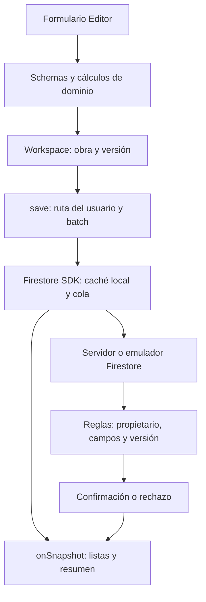

# Guía técnica de Obra

**Para:** quien mantenga, revise o amplíe la aplicación.

**Base documentada:** código de la versión 1.0.0, revisado el 14 de septiembre de 2026.

**Carpeta:** `/Users/crisgf/projects/construction-control`.

Esta guía describe la implementación existente y distingue los ejemplos de ampliación de las funciones ya disponibles. Para operación cotidiana, consulta el [manual de usuario](MANUAL_USUARIO.md). Para puesta en marcha y despliegue, consulta el [README](../README.md).

## Índice

1. [Recorrido para leer el código](#1-recorrido-para-leer-el-código)
2. [Arquitectura y flujo de datos](#2-arquitectura-y-flujo-de-datos)
3. [Modelo de datos](#3-modelo-de-datos)
4. [Cálculos y reglas de negocio](#4-cálculos-y-reglas-de-negocio)
5. [Autenticación, seguridad y sincronización](#5-autenticación-seguridad-y-sincronización)
6. [Entorno de desarrollo](#6-entorno-de-desarrollo)
7. [Cómo realizar ajustes](#7-cómo-realizar-ajustes)
8. [Pruebas y revisión de cambios](#8-pruebas-y-revisión-de-cambios)
9. [Diagnóstico de problemas](#9-diagnóstico-de-problemas)
10. [Respaldos, migraciones y publicación](#10-respaldos-migraciones-y-publicación)

## 1. Recorrido para leer el código

Sigue este orden para entender una compra desde el formulario hasta Firestore:

| Orden | Archivo / símbolo | Qué revisar |
| --- | --- | --- |
| 1 | [src/domain.ts](../src/domain.ts): `purchaseSchema`, `cents`, `total`, `summary` | Estructura válida y cálculos exactos |
| 2 | [src/forms.tsx](../src/forms.tsx): `fields`, `Editor`, `submit` | Campos visibles, valores iniciales, conversión de importes y validación |
| 3 | [src/App.tsx](../src/App.tsx): `Workspace`, `submit` | Selección de obra, comprobación de versión y mensajes al guardar |
| 4 | [src/firebase.ts](../src/firebase.ts): `ref`, `save` | Ruta del documento y escritura por lotes |
| 5 | [firestore.rules](../firestore.rules): `owner`, `base`, `valid` | Autorización y validación en servidor |
| 6 | `Workspace` → `onSnapshot` → `Dashboard` / `Purchases` | Actualización local de listas y totales; confirmación posterior del servidor |
| 7 | [tests/domain.test.ts](../tests/domain.test.ts), [tests/forms.test.tsx](../tests/forms.test.tsx), [tests/rules.test.ts](../tests/rules.test.ts) | Comportamiento esperado y casos de rechazo |

En el editor, usa “Buscar símbolo” o busca el nombre de la función. Las referencias a símbolos resisten mejor los cambios que los números de línea.

### Mapa del proyecto

| Archivo | Responsabilidad |
| --- | --- |
| [src/main.tsx](../src/main.tsx) | Monta React, `BrowserRouter`, estilos y registro del service worker |
| [src/App.tsx](../src/App.tsx) | Componentes `Auth`, `Workspace`, `Dashboard`, `Purchases`, `Team`, `Prices`; incluye pendientes y respaldo dentro de `Workspace` |
| [src/forms.tsx](../src/forms.tsx) | Editor reutilizable basado en descriptores de campo y títulos por tipo de registro |
| [src/domain.ts](../src/domain.ts) | Schemas Zod, tipos inferidos y funciones puras de dinero, fechas y resumen |
| [src/firebase.ts](../src/firebase.ts) | Inicialización del SDK modular, autenticación por app, caché por cuenta y escritura |
| [src/backup.ts](../src/backup.ts) | Validación JSON, serialización CSV, descarga y generación ICS |
| [src/styles.css](../src/styles.css) | Estilos globales, tarjetas, formularios y puntos de adaptación móvil |
| [vite.config.ts](../vite.config.ts) | React, configuración PWA, manifest generado, precaché y división del bundle |
| [public](../public) | Iconos PNG de 192 y 512 píxeles |
| [firebase.json](../firebase.json) | Puertos de emuladores, reglas, índices, Hosting y fallback a `index.html` |
| [firestore.indexes.json](../firestore.indexes.json) | Índices compuestos; actualmente vacío porque los filtros se aplican localmente |
| [Dockerfile](../Dockerfile), [compose.yaml](../compose.yaml) | Node/JDK/Chromium, servicios, volúmenes, señales y healthcheck |
| [package.json](../package.json), [package-lock.json](../package-lock.json) | Scripts, versiones y resolución reproducible de dependencias |
| [scripts](../scripts) | Emuladores, demostración y verificaciones complementarias |
| [VERIFICATION.md](../VERIFICATION.md) | Evidencia de la verificación anterior y alcance de sus resultados |

`dist/` es generado. No edites sus archivos: el siguiente build los reemplaza. `node_modules/`, logs y `test-results/` tampoco son código fuente.

## 2. Arquitectura y flujo de datos

No existe un servidor de aplicación propio ni una API REST desarrollada para este producto. El navegador utiliza directamente Firebase Authentication y Firestore mediante el SDK. Las reglas de Firestore son la frontera de seguridad.



### Entrada y navegación

`App` escucha `onAuthStateChanged`. Sin usuario muestra `Auth`; con usuario monta `Workspace` con `key={user.uid}`, de modo que cambiar de cuenta crea un estado de interfaz nuevo.

`BrowserRouter` mantiene la URL. La selección de pantalla se hace actualmente comparando `useLocation().pathname` en `App.tsx`, no mediante un árbol separado de componentes `<Routes>`.

| URL | Pantalla |
| --- | --- |
| `/` | Resumen |
| `/compras` | Compras y filtros |
| `/pendientes` | Actividades, conversión y calendario |
| `/equipo` | Trabajadores y compromisos de mano de obra |
| `/precios` | Comparación de precios |
| `/ajustes` | Respaldo, importación, edición y eliminación de obra |

### Lecturas

`Workspace` escucha las obras de la cuenta y las seis subcolecciones de la obra activa. Las consultas usan `includeMetadataChanges: true` para recibir cambios de estado de sincronización, aunque los datos no hayan cambiado.

Los registros se conservan en estado React; búsquedas, filtros y sumas se ejecutan localmente. `recordData` y `dataProject` evitan presentar registros de la obra anterior mientras cambia el selector. `dataReady` espera las consultas necesarias antes de habilitar exportaciones. Al cambiar de obra o desmontar, se cancelan los listeners.

Esta estrategia favorece uso offline en obras personales. Para aumentar mucho la escala, hay que diseñar consultas/paginación sin perder los datos requeridos sin conexión; no basta con agregar un `limit()` a una consulta usada para calcular totales.

### Escrituras

1. `Editor` mantiene los valores introducidos como cadenas.
2. Los campos `money` se convierten a enteros con `cents()`.
3. El schema del tipo de registro valida el documento.
4. `Workspace.submit` compara la versión que abrió el formulario con la versión actual en memoria.
5. `save()` vuelve a validar, construye una referencia acotada al usuario y hace `batch.set`.
6. Firestore muestra el cambio local y mantiene la escritura pendiente hasta recibir respuesta.
7. El callback de éxito informa confirmación del servidor; un rechazo muestra un error.

**No esperes `batch.commit()` como condición para actualizar toda la interfaz offline:** su promesa de confirmación puede seguir pendiente sin Internet. Tampoco anuncies “guardado en la nube” solo porque cerró el formulario.

## 3. Modelo de datos

Ruta principal:

```text
users/{uid}/projects/{projectId}
  purchases/{purchaseId}
  pendingItems/{pendingItemId}
  workers/{workerId}
  laborPayments/{paymentId}
  suppliers/{supplierId}
  materials/{materialId}
```

Cada documento de negocio contiene:

| Campo | Tipo / uso |
| --- | --- |
| `id` | UUID; coincide con el ID de la ruta |
| `projectId` | UUID de la obra; en el documento Project coincide con su propio `id` |
| `createdAt` | Número entero de milisegundos desde epoch; generado por el cliente |
| `updatedAt` | Número entero de milisegundos; actualizado en cada cambio |
| `version` | Entero: 1 al crear, versión anterior + 1 al editar |
| `deleted` | Booleano para borrado lógico |

No se almacena `uid` dentro de documentos de negocio. La identidad se obtiene de Auth y de la ruta. Las reglas rechazan un campo `uid` en esos documentos.

### Entidades y campos específicos

Los tipos, salvo `UserProfile`, se derivan de schemas Zod mediante `z.infer`. Cambiar el schema cambia el tipo TypeScript.

| Entidad | Campos específicos almacenados |
| --- | --- |
| `Project` | `name`, `description`, `location`, `budgetCents`, `startDate`, `endDate`, `status` |
| `Purchase` | `date`, `category`, `material`, `quantity`, `unit`, `unitPriceCents`, `supplier`, `paidCents`, `paymentMethod`, `reference`, `notes`, `pendingItemId` |
| `PendingItem` | `type`, `material`, `quantity`, `unit`, `unitPriceCents` —estimado—, `supplier`, `dueDate`, `buyDate`, `receiveDate`, `priority`, `status`, `notes`, `purchaseId` |
| `Worker` | `name`, `role`, `phone`, `agreement`, `rateCents`, `active`, `notes` |
| `LaborPayment` | `workerId`, `period`, `description`, `agreedCents`, `paidCents`, `date`, `paymentMethod`, `reference`, `notes` |
| `Supplier` | `name`, `phone`, `notes` |
| `Material` | `name`, `unit`, `category` |

`UserProfile` declara `id`, `email`, `createdAt` y `updatedAt`. Hay reglas para `users/{uid}`, pero el flujo actual de registro usa Auth y no crea automáticamente un documento UserProfile.

Supplier y Material tienen tipos, schemas, soporte de respaldo y rutas. No hay pantallas independientes para administrar estos catálogos. Compras y pendientes usan nombres de material/proveedor como texto; no usan claves foráneas hacia esos catálogos.

### Representación y límites

- Dinero: entero no negativo, máximo `99999999999` centavos por campo. `total()` también limita el total de una línea.
- Cantidad: cadena decimal con hasta siete dígitos enteros y tres decimales. Ejemplo: `"1.250"`.
- Textos cortos: generalmente hasta 160 caracteres; notas/descripciones hasta 1000; teléfono de Worker hasta 40 en Zod.
- Fechas de negocio: cadenas `YYYY-MM-DD` o `YYYY-MM-DDTHH:mm`, sin sufijo de zona; vacías donde se admite ausencia.
- Metadatos temporales: números, no `Timestamp` de Firestore ni `serverTimestamp()`.
- Relaciones vacías: `pendingItemId` y `purchaseId` usan `""`.

La validación de formularios, Zod y reglas no es idéntica en todos los detalles. Por ejemplo, la fecha de inicio es obligatoria en el formulario, mientras el schema admite la cadena vacía. Al cambiar un requisito, revisa las tres capas.

## 4. Cálculos y reglas de negocio

### Dinero exacto

```ts
cents("71.99")             // 7199
// 35 sacos, precio en centavos:
total("35", 7199)          // 251965
money(251965)              // "Q2,519.65"
```

`total()` convierte la cantidad a milésimas, multiplica con `BigInt` y redondea half-up al centavo una vez por línea. No lo sustituyas por `Math.round(parseFloat(precio) * cantidad * 100)`: eso introduce otra ruta de redondeo.

`total()` debe recibir un precio entero validado; `cents()` convierte la cadena y el schema aplica el límite de negocio. No todos los auxiliares validan por sí solos todas las precondiciones.

No se almacenan `totalCents`, `balanceCents` ni estado de pago en Purchase. Se calculan:

```text
total de compra = total(quantity, unitPriceCents)
saldo de compra = total de compra - paidCents
saldo de mano de obra = agreedCents - paidCents
```

`paymentStatus` devuelve pagado cuando pagado ≥ acordado, parcial cuando es mayor que cero, y pendiente en otro caso. Los schemas y reglas impiden que el abono exceda el total. Un registro con total cero y pago cero se clasifica como pagado.

### Resumen de la obra

`summary()` excluye documentos con `deleted: true` y devuelve:

```text
spent = suma de abonos de compras + suma de abonos de mano de obra
committed = saldos de compras + saldos de mano de obra + estimaciones pendientes
available = budgetCents - spent - committed
percent = spent / budgetCents × 100; null si budgetCents es cero
```

`percent` usa gastos realizados, no gastos más compromisos. Las alertas de 80/90/100 % se renderizan en `Dashboard`. El presupuesto puede quedar negativo después de comprometer más de lo previsto; no se oculta ese resultado.

`estimated()` deja de contar una estimación si tiene `purchaseId` o si el estado es cancelado, completado, recibido, comprado o en camino. Cambiar uno de esos estados manualmente también cambia el compromiso, aunque no exista compra vinculada.

### Conversión y borrado

Convertir un pendiente abre un formulario de compra con los datos disponibles. Al guardar se escribe en el mismo batch la compra y el pendiente actualizado a comprado, con enlaces en ambas direcciones. La estimación se excluye y el saldo de la compra pasa a formar parte del compromiso.

La interfaz realiza borrado lógico con confirmación, aunque las reglas también permiten al propietario un borrado físico por API en sus rutas de negocio. Eliminar una compra vinculada no reactiva la estimación anterior. Eliminar una obra no elimina en cascada sus subcolecciones. No existe papelera visible.

### Fechas y precios

`today()`, `localNow()` y `dateLabel()` usan Guatemala. `Dashboard` clasifica pendientes con límite anterior a la hora actual como vencidos; para hoy son los del día cuyo límite todavía no pasó. Los sin fecha no entran en esos tres contadores. No hay un temporizador independiente para refrescar el reloj: se recalcula al renderizar.

`compare()` agrupa por material y unidad recortando espacios y comparando en minúsculas; ordena por fecha descendente. La pantalla obtiene las opciones de los textos registrados. Conviene mantener nomenclatura consistente. No convierte unidades, marcas ni presentaciones.

La diferencia de precios es absoluta y el porcentaje se calcula respecto de la compra A. El ahorro es esa diferencia multiplicada por la cantidad indicada.

## 5. Autenticación, seguridad y sincronización

### Apps Firebase y caché

La app Firebase principal conserva Auth. Para cada usuario, `database(uid)` crea o reutiliza una app nombrada `user-{uid}`; `prepareDatabase` copia a su instancia Auth el usuario de la sesión principal. Firestore utiliza esa autenticación.

Si `localStorage['trusted-device'] === 'yes'`, se configura `persistentLocalCache` con `persistentMultipleTabManager`; de lo contrario se usa `memoryLocalCache`. El nombre de app separa la persistencia por cuenta.

Al salir se cierran las sesiones de las apps de datos, la sesión principal y se navega a `/`. Se desmonta el estado privado. La caché persistente no se borra ni se cifra al cerrar sesión: permite recuperar pendientes de esa cuenta al volver a entrar.

### Reglas

- `owner(uid)` exige autenticación y coincidencia exacta del UID.
- `base(id, pid)` comprueba IDs, metadatos, borrado y versión; mantiene `createdAt` al actualizar.
- `valid(kind)` valida campos críticos, importes, cantidades y estados según colección.
- No hay permiso genérico para listar todas las cuentas ni para rutas no contempladas.

Los schemas Zod normalmente eliminan campos desconocidos; las reglas de negocio actuales no usan una lista exhaustiva `hasOnly` para todos los documentos. No atribuyas a las reglas una validación completa del schema que no implementan. Añade validación de servidor para cualquier nuevo campo que deba tener un límite o una restricción de seguridad.

### Conflictos

El control tiene dos momentos: la comprobación del formulario frente a datos actuales y la comprobación de versión en servidor. Un cambio desde otro dispositivo puede ser rechazado al reconectar, aunque antes fuera visible localmente.

`Recargar versión reciente` reconstruye el editor con la versión observada. No hay combinación automática de dos ediciones ni historial de auditoría inmutable. `save()` usa `set` del documento completo: al evolucionar schemas, considera que un cliente antiguo puede eliminar campos desconocidos al volver a guardar.

### Indicadores

`metadata` combina `hasPendingWrites` y `fromCache` de las consultas activas con `navigator.onLine`. Los mensajes conectado/sin conexión/sincronizando/conectando/con error no representan un monitor global de todas las obras: describen las consultas actualmente observadas. `Reintentar` habilita red y cambia `retryVersion` para volver a suscribirlas.

El shell se precachea mediante Workbox; los datos privados quedan a cargo del SDK de Firestore. No agregues caché genérica de respuestas de Auth/Firestore al service worker.

## 6. Entorno de desarrollo

Todos estos comandos se ejecutan desde la carpeta del proyecto. El anfitrión necesita Docker con Compose; las herramientas de Node, Java, Firebase y Chromium están dentro de la imagen.

```bash
cd /Users/crisgf/projects/construction-control
docker compose up -d --build
docker compose ps
```

| Dirección / nombre | Uso |
| --- | --- |
| `http://localhost:5173` | Vite con recarga automática; úsalo mientras editas |
| `http://localhost:5002` | Hosting local que sirve el último `dist`; requiere recompilar para ver ajustes |
| `http://localhost:4173` | Vista previa opcional de Vite |
| `http://localhost:4000` | Emulator UI |
| `localhost:9099` / `localhost:8080` | Auth / Firestore accesibles desde el navegador del Mac |
| `emulators:9099` / `emulators:8080` | Servicios accesibles entre contenedores |
| `obra-dev:5173` | Alias interno usado por el chequeo de HMR; no es una URL del Mac |

El puerto 5002 evita el conflicto frecuente de 5000 con AirPlay. Las sesiones, cachés y service workers son distintos para cada origen: iniciar sesión en 5173 no inicia automáticamente sesión en 5002.

### Edición y compilación

```bash
# Tras cambiar código, revisa primero 5173; después genera la PWA:
docker compose run --rm app npm run build
# Vista previa opcional, además de Hosting en 5002:
docker compose run --rm -p 4173:4173 app npm run preview
# Diagnóstico:
docker compose logs --tail=100 app emulators
```

Cambiar variables `VITE_*` requiere reiniciar Vite o volver a compilar, según qué servidor uses. Son valores públicos incorporados en el bundle, no secretos de servidor.

| Variable | Efecto |
| --- | --- |
| `VITE_USE_EMULATORS` | Debe ser `true` para desarrollo. Compose lo fuerza a `true` salvo override explícito |
| `VITE_EMULATOR_HOST` | Nombre/IP accesible desde el navegador; `localhost` en el Mac y `emulators` en las pruebas de navegador dentro de Docker |
| `VITE_FIREBASE_API_KEY`, `VITE_FIREBASE_AUTH_DOMAIN`, `VITE_FIREBASE_PROJECT_ID`, `VITE_FIREBASE_APP_ID` | Configuración pública de la app Firebase; ejemplos en [.env.example](../.env.example) |
| `FIRESTORE_EMULATOR_HOST` | Variable de las pruebas en Node: `emulators:8080`; no sustituye la variable del navegador |

La PWA y `crypto.randomUUID()` requieren un contexto seguro compatible. Para teléfono utiliza HTTPS; una IP LAN por HTTP no es equivalente a `localhost` del Mac. No abras los emuladores a Internet.

### Dependencias y volúmenes

El código se monta desde el anfitrión. `node_modules` es un volumen nombrado, y no se sustituye automáticamente cuando reconstruyes la imagen.

Para actualizar una dependencia, detén la app, realiza el cambio dentro de Docker y conserva el lockfile:

```bash
docker compose stop app
# Sustituye PAQUETE y VERSION por el paquete y versión elegidos:
docker compose run --rm --no-deps app npm install --save-exact PAQUETE@VERSION
# Para una herramienta de desarrollo, usa --save-dev además de --save-exact.
docker compose build
docker compose run --rm --no-deps app npm ci
docker compose up -d
```

No copies literalmente `PAQUETE@VERSION`: es un marcador. Revisa los cambios de `package.json` y `package-lock.json` y vuelve a ejecutar las pruebas pertinentes.

`emulator_data` conserva la exportación de Auth/Firestore y `emulator_cache` las descargas. `scripts/emulators.mjs` inicia la CLI directamente con Node; reenvía una sola señal SIGINT para que exporte antes de terminar. No vuelvas a introducir capas npm/npx entre Compose y ese supervisor: se corrigió un problema real de pérdida de exportación por señales.

```bash
# Parada normal: conserva los volúmenes y espera la exportación.
docker compose down
```

`docker compose down -v` borra los volúmenes, incluidas cuentas y obras de los emuladores. No lo uses para solucionar un error de compilación.

## 7. Cómo realizar ajustes

### A. Cambiar un texto, color o tamaño

1. Busca el texto en `App.tsx`; si es etiqueta de formulario, búscalo en `forms.tsx`.
2. Para estilos, localiza la clase en `styles.css`, por ejemplo `.budget-card`, `.quick-actions`, `.record` o `.bottom-nav`.
3. Revisa también los bloques `@media`: una regla móvil puede sobrescribir la de escritorio.
4. Comprueba 320, 390 y 1440 px, nombres largos, importes grandes y el formulario abierto.
5. Prueba en 5173. Compila antes de revisar 5002.

Cambiar una etiqueta visible no requiere cambiar el nombre del campo almacenado. Los tests de formulario y Playwright usan etiquetas accesibles; si cambias intencionalmente una, actualiza sus localizadores.

Para cambiar nombre/iconos de instalación, revisa el manifest en `vite.config.ts`, el título en `index.html`, `public/` y la marca en `App.tsx`. La versión ya instalada puede tardar en reflejar un nuevo icono según el dispositivo.

### B. Añadir un campo a compras: ejemplo de `deliveryAddress`

Este campo **no existe actualmente**; el ejemplo indica las capas que tendrías que editar.

1. En `purchaseSchema`, añade un campo compatible con registros anteriores:

```ts
// Dentro del objeto de purchaseSchema:
deliveryAddress: short.default(""),
```

2. En `fields.purchases` de `forms.tsx`, agrega:

```ts
f("deliveryAddress", "Dirección de entrega"),
```

3. Añade su presentación en `Purchases` si debe verse sin abrir el editor.
4. En la rama de compras de `valid(kind)`, limita el valor y admite ausencia mientras convivan documentos/clientes antiguos:

```text
&& (!('deliveryAddress' in d) || small(d.deliveryAddress))
```

5. Decide cómo tratar datos anteriores. El schema con default cubre edición e importación, pero las lecturas de `onSnapshot` usan casts, no parseo de todos los documentos. En presentación usa, por ejemplo, `p.deliveryAddress || 'Sin dirección'`.
6. Verifica exportación/importación y el comportamiento al editar con una versión anterior de la app. Cambiar un schema reutilizado modifica también `backupSchema`.
7. Añade una prueba de dato antiguo sin campo, otra de guardado y otra de rechazo por longitud en las reglas.

**No basta con agregar un `<input>`:** sin schema el nuevo campo puede ser eliminado por Zod al guardar. Tampoco basta con editar solo el schema si el usuario no tiene una forma de introducir el dato.

### C. Cambiar un cálculo o incluir un costo adicional

Centraliza la fórmula en `domain.ts`. Revisa el impacto en `summary`, validación, reglas, editor, listas, comparador y archivos exportados. Mantén enteros para dinero.

Si añades flete, define antes si pertenece al total de la compra o a otra compra de servicio, si afecta precio comparable por unidad y qué parte está pagada. Prueba una compra parcial, conversión, edición, eliminación y reconexión. No agregues un campo que `summary()` ignore silenciosamente.

Para cambiar umbrales visuales de presupuesto, revisa `Dashboard`. Eso no requiere alterar la fórmula de `percent` salvo que también cambie su definición.

### D. Añadir un estado de pendiente

Revisa `pendingStates`, `estimated()`, los filtros de agenda en `Dashboard`, estilos de vencimiento, listas permitidas en reglas y pruebas de respaldo. Define explícitamente si el nuevo estado cuenta como compromiso y si todavía aparece en la agenda. No todos los controles de estado están centralizados en una sola lista.

### E. Añadir una pantalla o colección

Para pantalla: agrega entrada a `nav`, condición de contenido y navegación accesible; considera móvil y ruta directa.

Para colección: agrega schema, tipo, `Kind`, `RecordData`, `ProjectData`, `emptyData`, reglas y pruebas de aislamiento. Revisa respaldo/importación, su contador máximo y remapeo de relaciones. Las suscripciones se crean desde `emptyData`; añadir una entrada cambia también las lecturas por obra.

Antes de ampliar mucho `App.tsx`, considera extraer componentes de pantalla y un hook de consultas. Conserva la separación por UID/proyecto y la cancelación de listeners durante esa refactorización.

## 8. Pruebas y revisión de cambios

### Comandos

```bash
docker compose run --rm app npm run lint
docker compose run --rm app npm run typecheck
docker compose run --rm app npm test
docker compose run --rm app npm run test:rules
docker compose run --rm -e VITE_EMULATOR_HOST=emulators app npm run test:e2e
# Las pruebas anteriores generan dist apuntando al host interno de Docker.
# Restablece después el build para el navegador del Mac:
docker compose run --rm app npm run build
```

| Cambio | Verificación principal |
| --- | --- |
| Fórmula, schema o importes | `domain.test.ts` y casos afectados del formulario |
| Campo o validación visible | `forms.test.tsx`, tipos y flujo de navegador |
| Rutas, auth o reglas | `rules.test.ts` y flujos de dos cuentas/cierre de sesión |
| Caché, promesas, versiones o listeners | Flujo Playwright offline y reconexión |
| Respaldo o relaciones | Pruebas JSON/CSV/ICS y recorrido exportar/importar |
| Layout | Revisión visual móvil/escritorio y ancho 320 px |
| Docker o supervisor de emuladores | Arranque, HMR y ciclo de persistencia |

`npm test` ejecuta dominio y formulario; las reglas y Playwright son comandos separados. Los mensajes `PERMISSION_DENIED` son esperados cuando las pruebas de reglas llaman a `assertFails`.

`playwright.config.ts` inicia una compilación y un servidor preview en 4173 dentro del contenedor. No necesita un navegador instalado globalmente. Los resultados anteriores en `VERIFICATION.md` no sustituyen ejecutar los tests después de un cambio.

### Comprobaciones auxiliares

```bash
docker compose run --rm app node scripts/check-hmr.mjs
# Crea una obra adicional de ejemplo cada vez; úsalo solo en emuladores.
docker compose run --rm app node scripts/seed.mjs
docker compose run --rm app node scripts/check-persistence.mjs --capture
docker compose down
docker compose up -d
docker compose run --rm app node scripts/check-persistence.mjs
```

No ejecutes Playwright entre captura y comparación: limpia `test-results`. El chequeo de persistencia compara Auth, UID y documentos Project; no compara individualmente todas las subcolecciones.

Las capturas de `scripts/visual-check.mjs` requieren la cuenta demo y un `dist` compilado con `VITE_EMULATOR_HOST=emulators`, porque su navegador vive dentro de Docker y abre Hosting por ese nombre. Al terminar, recompila para `localhost`.

### Preguntas para una revisión de código

- ¿Toda nueva consulta/escritura se acota al UID y obra correctos y está protegida por reglas?
- ¿Se conserva `createdAt`, se incrementa `version` y se considera un formulario atrasado?
- ¿El cambio mantiene los importes exactos y evita sumar una estimación junto a su compra?
- ¿Los documentos borrados quedan fuera de los totales correctos?
- ¿Se distingue el cambio local de la confirmación remota?
- ¿Los nuevos campos sobreviven a guardar, exportar, importar y editar registros anteriores?
- ¿Se cancelan listeners al cambiar de usuario/obra y se evitan exportaciones incompletas durante la carga?
- ¿Los mensajes y botones siguen siendo utilizables a 320 px?

## 9. Diagnóstico de problemas

| Síntoma | Qué comprobar |
| --- | --- |
| Docker no conecta | Inicia Docker Desktop; revisa `docker compose ps` |
| Puerto ocupado | Revisa `ports` de Compose; no cambies el puerto interno sin revisar SDK/configuración/pruebas |
| Editas código y 5002 no cambia | Ese puerto sirve `dist`; recompila o usa 5173 |
| HMR no funciona | Revisa logs de app, montaje de código y consola del navegador; ejecuta `check-hmr.mjs` sin editar CSS simultáneamente |
| Tras E2E falla el acceso desde el Mac | El último build puede apuntar a `emulators`; ejecuta el build normal |
| Guardado rechazado | Revisa versión, campos, `projectId`, ruta y reglas. No abras las reglas globalmente para esconder el fallo |
| Importe no válido | Introduce punto decimal, sin `Q` ni separadores de miles; máximo dos decimales de precio y tres de cantidad |
| No aparece una compra | Revisa cuenta, obra, filtros y `deleted`; no asumas que es problema de Firebase |
| El modo offline está vacío | Confirma origen/navegador, dispositivo de confianza y carga previa; revisa IndexedDB y Service Workers en las herramientas del navegador |
| Se pierden emuladores al detener | Comprueba comando directo del supervisor, `/data/export`, volumen y cierre normal; evita `down -v` y apagado forzado |
| JSON rechazado | Comprueba formato/version, límite, schemas, IDs repetidos y relaciones completas |

No limpies IndexedDB como primer paso si hay escrituras pendientes. Eso elimina trabajo que todavía no llegó al servidor. Inspeccionar Emulator UI ayuda en desarrollo, pero sus capacidades administrativas no equivalen a los permisos del usuario en la aplicación; las pruebas de reglas son las que comprueban esos permisos.

## 10. Respaldos, migraciones y publicación

El respaldo tiene `format: "obra-backup"`, `version: 1`, `exportedAt`, `project` y `data`. JSON incluye borrados lógicos; CSV solo exporta registros vivos de la colección elegida y mantiene los nombres/cantidades almacenados en centavos. El CSV no incluye automáticamente totales derivados o nombres de trabajador a partir de `workerId`.

`parseBackup()` valida límites, IDs repetidos, trabajadores referenciados y enlaces recíprocos compra/pendiente. `doImport()` crea una obra nueva, regenera IDs/metadatos, conserva `deleted` de las filas y remapea relaciones. Cuenta hasta 450 registros de subcolecciones y usa un batch, además del documento de obra. No hace merge con la obra activa.

Para un cambio incompatible de formato, no reemplaces sin más `version: 1`: define schemas por versión y una transformación explícita a la estructura actual. Añade fixtures de respaldos antiguos. Prueba que un archivo no pueda escoger el UID destino. Los cambios de schema no migran automáticamente documentos existentes de Firestore.

Las publicaciones requieren configuración real y decisión del propietario. Sigue los pasos y comandos de despliegue del [README](../README.md), incluidos el override `VITE_USE_EMULATORS=false`, reglas e índices. Nunca publiques un build E2E que apunte a `emulators` ni habilites servicios facturables como parte de una corrección rutinaria.

Mantén estas guías junto al código: cuando cambies campos, rutas, fórmulas o comandos, actualiza también el manual de usuario y la evidencia de pruebas correspondiente.


## Repositorio Git y publicación de cambios

Remoto del proyecto: `https://github.com/cris-gf/construction-control.git`.

El repositorio contiene fuentes, iconos, pruebas, documentación, reglas y configuración reproducible. `.env.example` contiene únicamente valores de demostración y sirve como plantilla. `.gitignore` excluye `.env`, variantes locales, credenciales, datos de emuladores, respaldos, dependencias, compilaciones y resultados de pruebas; `.dockerignore` evita copiarlos también a las imágenes.

Antes de crear un commit, revisa el contenido preparado:

```bash
git status --short
git diff
git diff --cached --stat
git diff --cached
# Explica la exclusión incluso si el archivo aún no existe:
git check-ignore -v .env .env.production backups/obra.json
```

Añade rutas concretas con `git add` y agrupa cambios por propósito: funcionalidad, pruebas y documentación. Conserva `package-lock.json` al actualizar dependencias. Revisa el diff antes de cada commit; las exclusiones por nombre no detectan secretos pegados accidentalmente dentro de un archivo de código. No uses `git add -f` para incluir configuración real o respaldos. Un archivo ya versionado no deja de estarlo por añadirlo a `.gitignore`.

Para publicar cambios de mantenimiento, crea una rama y sube esa rama para revisión:

```bash
git switch -c ajuste/nombre-del-cambio
# Edita, prueba y prepara explícitamente los archivos del cambio.
git commit -m "fix: describir el ajuste realizado"
git push -u origin HEAD
```

Sustituye el nombre de rama y el mensaje por los de tu cambio. La autenticación de GitHub se gestiona con las credenciales del equipo, fuera del repositorio. No incluyas tokens en la URL del remoto ni en archivos versionados.
